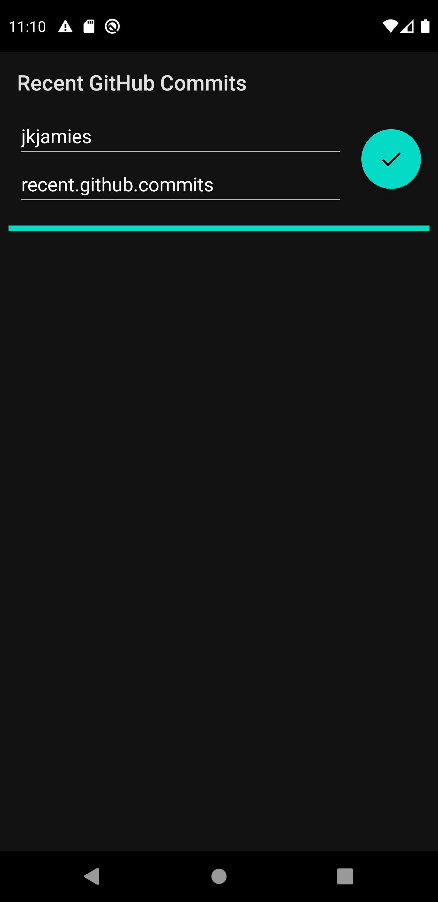
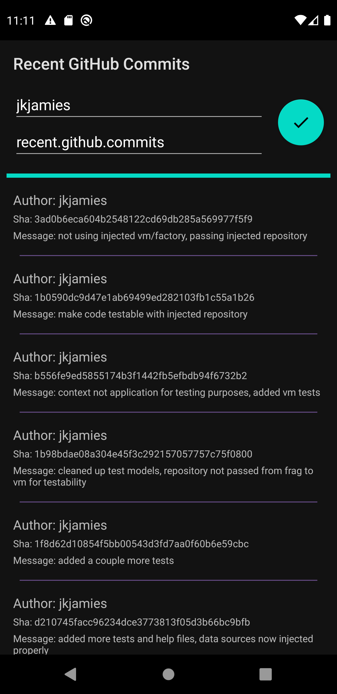
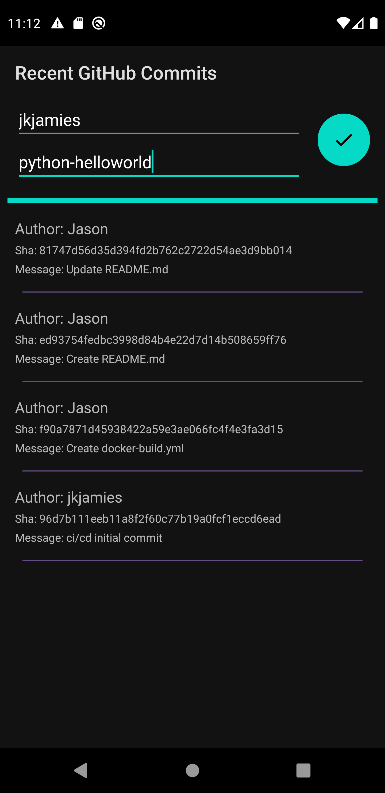
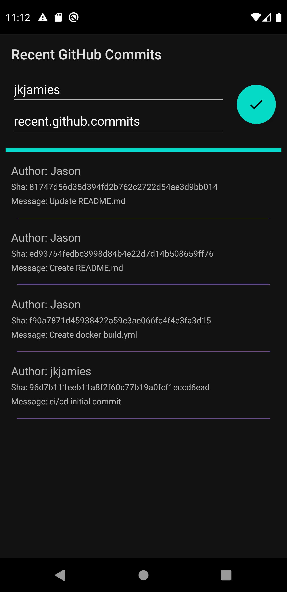

# recent.github.commits
Recent GitHub commits in a simple list from the GitHub api.
\
Enter owner of repository into the owner editText\
Enter name of repository into the repository editText\
\
Default owner is jkjamies, and default repository is recent.github.commits\
\
When you start the application for the first time, you will see the following:\
\
\
\
Following searching the default values using the Floating Action Button, you will see the following:\
\
\
\
Following searching another repository, the list will load as long as the repository and owner value are valid.\
\
\
\
If the application is closed and reopened, the database is used to initially load data. The owner and repository, however,
are set back to the default values to demonstrate that local database values were utilized.\
\
\